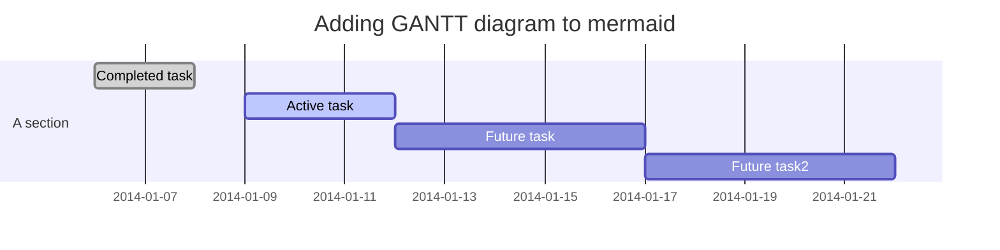
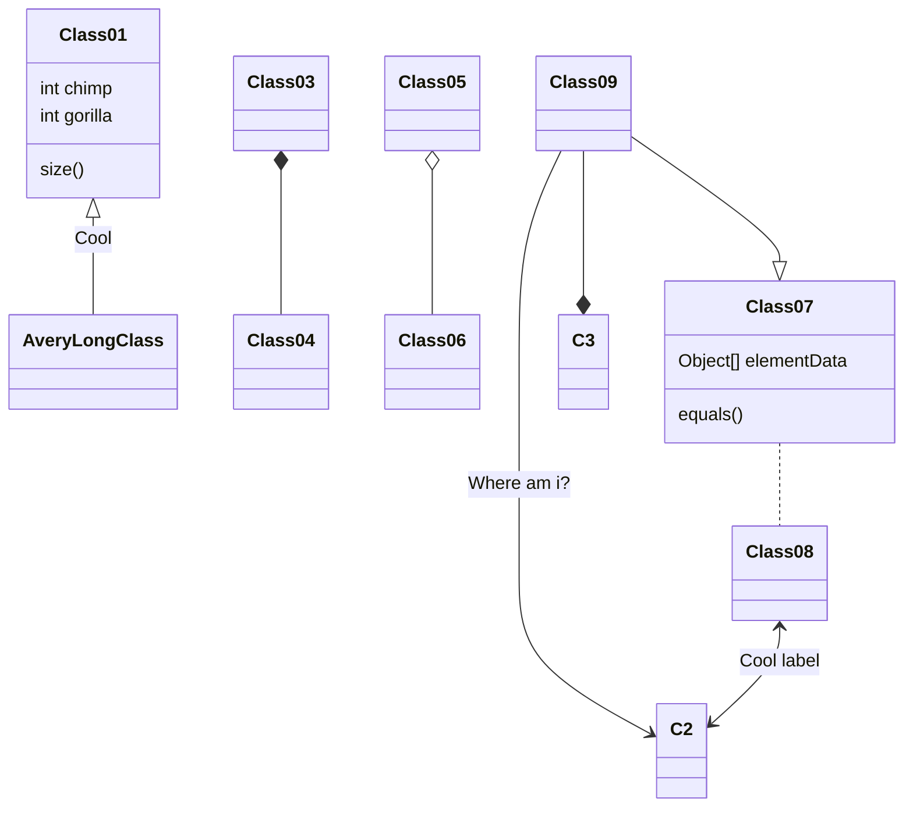

---
title: Inferno
author: 'Peter Kourzanov'
version: 0.0.1
output: word_document
---  
  
  
  
  
  
* [§ Inferno](#inferno )
	* [§ Foo](#foo )
		* [§ Bar](#bar )
			* [§ Step1](#step1 )
					* [§ Code for &laquo;code/bar.py&raquo; (2)](#code-for-laquocodebarpychunk-code-barpyraquo-2 )
			* [§ Step2](#step2 )
					* [§ Code for &laquo;code/bar.py&raquo; (4)](#code-for-laquocodebarpychunk-code-barpyraquo-4 )
* [§ Appendix](#appendix )
	* [§ Chunks](#chunks )
	* [§ Definitions](#definitions )
	* [§ Hierarchy](#hierarchy )
	* [§ Full code listings](#full-code-listings )
		* [§ &laquo;code/bar.py&raquo;](#laquocodebarpyraquo )
  
  
  
  
# Inferno
  
  
<del>This</del><ins>That</ins> repository[^1] is <mark>currently</mark> **not** in use, be$`\cos{\pi\over 2}=0`$..
[^1]: and only this one
  
Moreover,
```math
\sin^2{x}+\cos^2{x}=1
```
Some diagrams:
  
1. one
  

2. two
  

3. three
  

4. four
  

  
<table class="noborder"><tr><th>1st</th><th>2nd</th></tr>
<tr><td>
  
*one* [Module](Module.md)
```julia
1+2
```
</td>
<td>
  
**two**
* foo
* bar</td>
</tr>
</table>
  
Here comes a [Module](Module.md ).
  
  
  
  
  
## Foo
  
  
  
### Bar
  
  
  
#### Step1
  
 Define a variable
<div id="chunk-code-bar.py-2"/>
  
###### Code for &laquo;[code/bar.py](#chunk-code-bar.py )&raquo; (2)
  
  
```python
var=2
```
<div id="symbol-var"/>
  
  
#### Step2
  
 Use it.
<div id="chunk-code-bar.py-4"/>
  
###### Code for &laquo;[code/bar.py](#chunk-code-bar.py )&raquo; (4)
  
  
```python
print("var =",var+1)
```
  
___
# Appendix
  
## Chunks
  
1. &laquo;[code/bar.py](#chunk-code-bar.py )&raquo;: [2](#chunk-code-bar.py-2 ),[4](#chunk-code-bar.py-4 )
  
## Definitions
  
1. [var](#symbol-var ): &laquo;[code/bar.py](#chunk-code-bar.py )&raquo; ([2](#chunk-code-bar.py-2 ))
  
## Hierarchy
  
  


<!-- code base= token= -->

<map id="deps" name="deps">
<area shape="poly" id="node1" href="#chunk-code-bar.py" title="code/bar.py" alt="" coords="151,29,147,22,137,15,121,10,101,7,78,5,56,7,35,10,19,15,9,22,5,29,9,37,19,43,35,49,56,52,78,53,101,52,121,49,137,43,147,37"/>
</map>
  
## Full code listings
  
  
<div id="chunk-code-bar.py"/>
  
### &laquo;code/bar.py&raquo;
  
```python
var=2
print("var =",var+1)
```
  
  
  
  
  