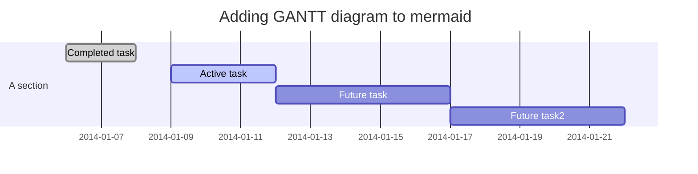
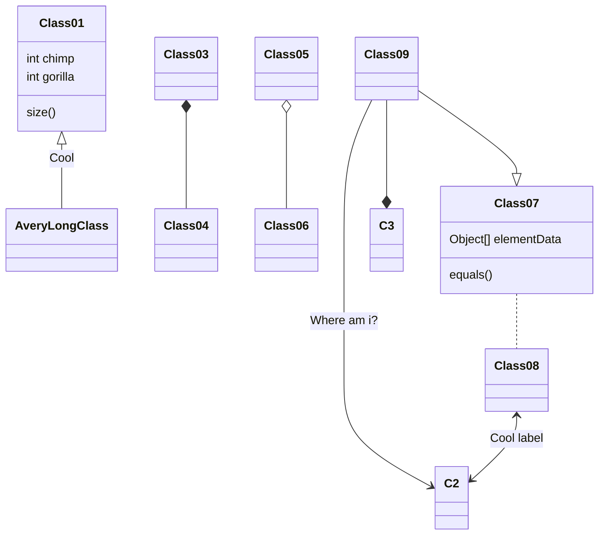

<!-- @import "[TOC]" {cmd="toc" depthFrom=1 depthTo=6 orderedList=false} -->
<!-- code_chunk_output -->

* [§ Inferno](#inferno)
	* [§ Foo](#foo)
		* [§ Bar](#bar)
			* [§ Step1](#step1)
					* [§ &laquo;code/bar.py&raquo; (≡ 2)](#laquocodebarpychunk-code-barpyraquo-2)
			* [§ Step2](#step2)
					* [§ &laquo;code/bar.py&raquo; (⩲ 4)](#laquocodebarpychunk-code-barpyraquo-4)
* [§ Appendix](#appendix)
	* [§ Chunks](#chunks)
	* [§ Definitions](#definitions)
	* [§ Hierarchy](#hierarchy)
	* [§ Full code listings](#full-code-listings)
		* [§ &laquo;code/bar.py&raquo;](#laquocodebarpyraquo)

<!-- /code_chunk_output -->

# Inferno

{~~This~>That~~} repository[^1] is {==currently==} **not** in use, be$`\cos{\pi\over 2}=0`$..
[^1]: and only this one

Moreover,
```math
\sin^2{x}+\cos^2{x}=1
```
Some diagrams:

1. one


2. two


3. three


4. four



<table class="noborder"><tr><th>1st</th><th>2nd</th></tr>
<tr><td>

*one* [[Module]]
```julia
1+2
```
</td>
<td>

**two**
* foo
* bar</td>
</tr>
</table>

Here comes a [Module](Module.md).

```latex {cmd=Noweb.bat args=["-b","-l","python"] stdin=true output=markdown hide=true run_on_save=true modify_source=true}
\subsection{Foo}
\subsubsection{Bar}
\paragraph{Step1} Define a variable
<<code/bar.py>>=
`var=2
@
\paragraph{Step2} Use it.
<<>>=
print("var =",var+1)
```
<!-- code_chunk_output -->


## Foo


### Bar


#### Step1
 Define a variable

<div id="chunk-code-barpy-2"/>

###### &laquo;[code/bar.py](#chunk-code-barpy)&raquo; (≡ 2)

```python {cmd=true id="code/bar.py 2" }
var=2
```
<div id="symbol-var"/>


#### Step2
 Use it.

<div id="chunk-code-barpy-4"/>

###### &laquo;[code/bar.py](#chunk-code-barpy)&raquo; (⩲ 4)

```python { continue="code/bar.py 2" cmd=true id="code/bar.py 4" }
print("var =",var+1)
```

___

___
# Appendix
## Chunks
1. &laquo;[code/bar.py](#chunk-code-barpy)&raquo;: [2](#chunk-code-barpy-2),[4](#chunk-code-barpy-4)

## Definitions
1. [var](#symbol-var): &laquo;[code/bar.py](#chunk-code-barpy)&raquo; ([2](#chunk-code-barpy-2))

## Hierarchy

```Dot.bat {cmd=true args=['-e','neato','-z','.25'] hide=true output=html run_on_save=true usemap="#deps"}
 digraph deps {bgcolor="#282c34"
node [color=white fontcolor=gray45]
edge [color=white fontcolor=gray45]
overlap=false
rankdir=LR
}
```
<map id="deps" name="deps">
</map>

## Full code listings

<div id="chunk-code-barpy"/>

### &laquo;code/bar.py&raquo;
```python {cmd=true stdin=false run_on_save=false id='code/bar.py'}
var=2
print("var =",var+1)
```


<!-- /code_chunk_output -->
